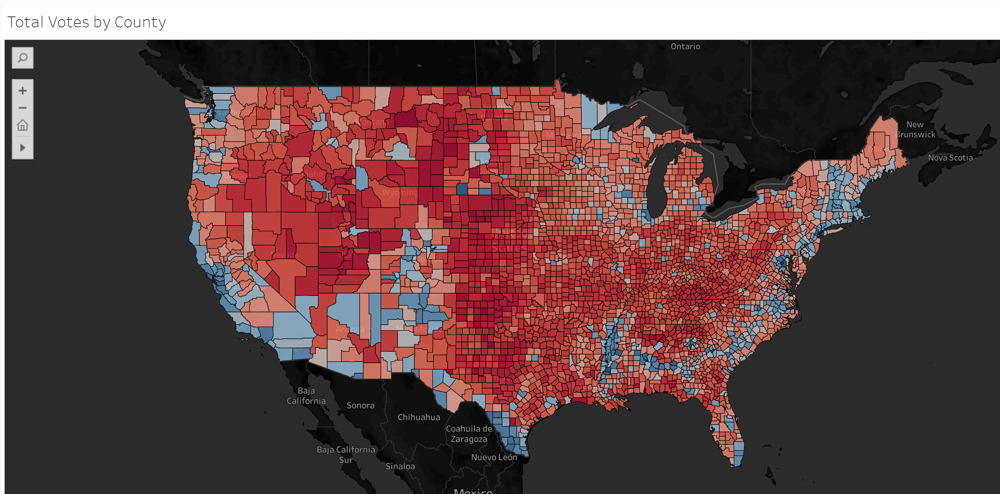
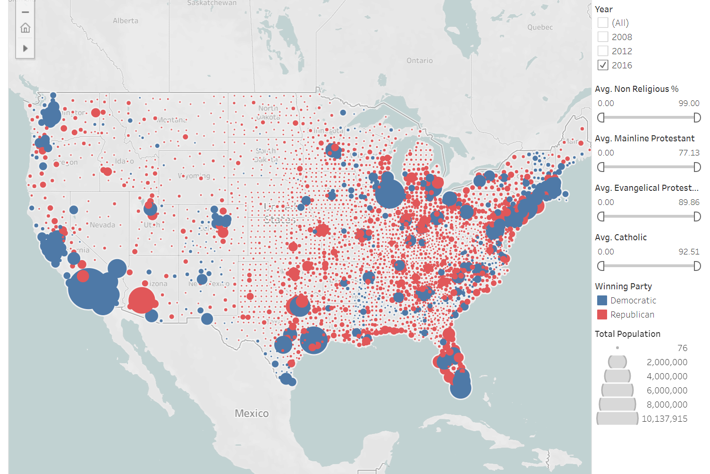
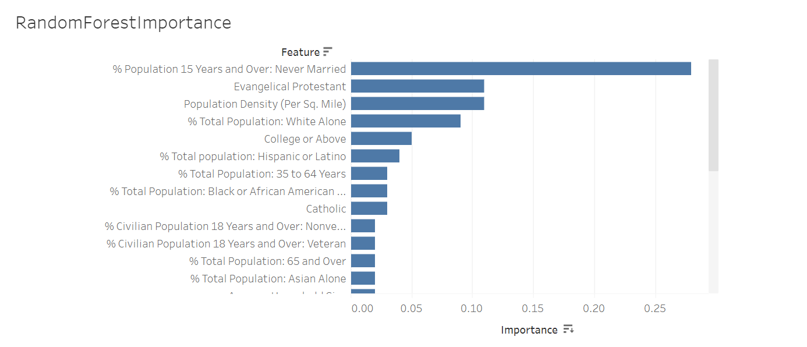
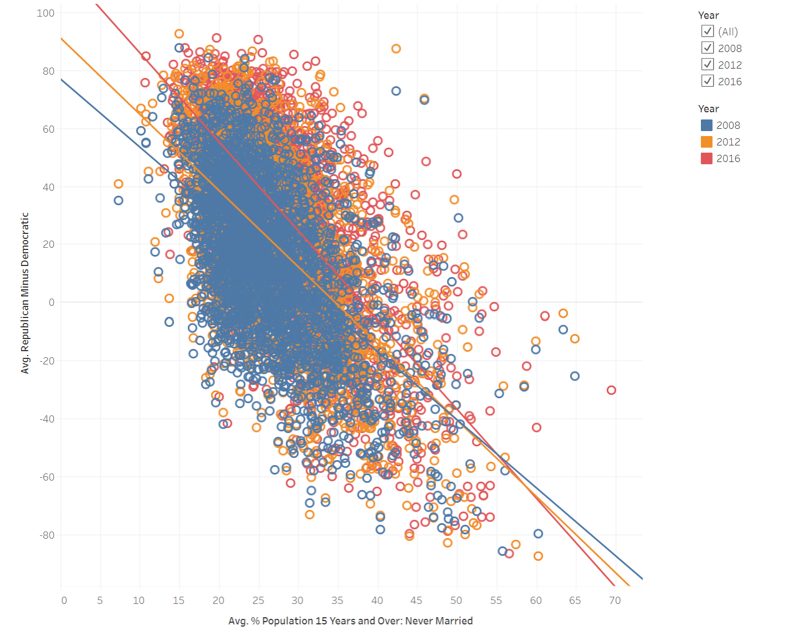
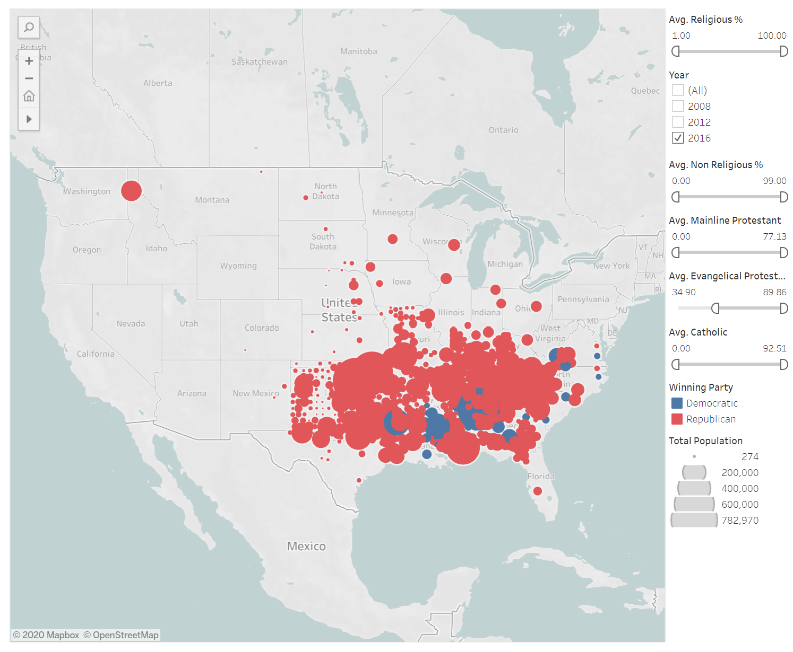

Election 2020 seeks to use census.gov demographic data to predict the winning presidential party in the next election by county.

This is a map of the winning party by county for the 2016 election. Geographically, if the viewer is familiar with the United States, this view can assist in answering what county voted for what party. (Please note that this project does not address the electoral college system which must be used to predict who will the presidency overall.)

But it becomes clear that land does not vote for presidents, people do. Here is a map showing geographical area and population voting for president. Visually this impacts which party was winning quantitatively. 

Using the demographic data changes from each election year, we feed that data into machine learning models. Multiple were tested to see which produced the best result.

Random Forest regression produced an accuracy of 93%, which is sufficeint for this project. (Read here for why 100% accuracy is undesireable: https://datascience.stackexchange.com/questions/43313/why-100-accuracy-on-test-data-is-not-good)

The Random Forest regression produced the variables that were important to determining winning party:

And we can examine those variables more closely throughout past elections through visualization:

This simple plot shows the steep slope between counties with a high percentage of never-married individuals versus counties with a high percentage of couples or being divorced. Having many people who have never married in your county is heavy predictor for democratic party vote.

This map has been adjusted so that it only shows counties that have greater than a third of it's population identifying as Evangelical. The size of the cirlce overlaying the county, shows how great of a percentage of the county is evangelical. This visual gives you a quick look at where evangelical religious affiliated people live, and how their affiliation is a strong predictor for republican party vote.

